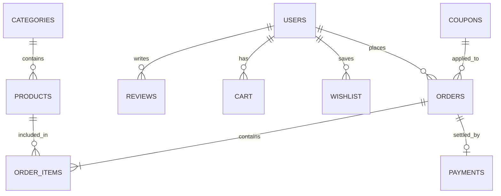

# ShopSmart AI – Intelligent E-Commerce Platform 🚀

[](https://github.com)
[](#)
[](#)

A full-stack, enterprise-grade e-commerce platform built to demonstrate end-to-end full-stack capabilities, advanced SQL reporting (Window Functions, CTEs, Stored Procedures), AI-powered natural language search, recommendation engine, Stripe payment gateway, and interactive sales analytics dashboard.

---

## 🌟 Recruiter Highlights & Enterprise Features

1. **AI Natural Language Search Engine**: Extracts price range (`Gaming Laptop under ₹60,000`), brands, and categories using regex parsing and fuzzy keyword matching.
2. **AI Recommendation Engine**: "Frequently Bought Together" (Amazon-style co-purchase algorithm) + personalized recommendations + trending items.
3. **Interactive Admin & Sales Analytics Dashboard**:
   - Monthly Revenue & Daily Orders Charts (Chart.js)
   - Customer Lifetime Value (CLV), Average Order Value (AOV), and Repeat Customer Rate
   - MySQL Window Functions (`DENSE_RANK()`) & Common Table Expressions (CTEs)
4. **Stripe Payment Gateway**: Test mode credit card integration + Cash on Delivery (COD).
5. **Real-time Order Tracking**: Live visual stepper (`Placed` → `Confirmed` → `Packed` → `Shipped` → `Delivered`).
6. **PDF Invoice Generator**: Automatic ReportLab PDF invoice generation for completed orders.
7. **AI Voice Search**: Web Speech API integration for hands-free voice searching.
8. **JWT Authentication & Security**: Password hashing with Bcrypt, role-based access control (Admin vs User), and CORS protection.

---

## 🛠️ Tech Stack

| Component | Technology |
|---|---|
| **Frontend** | React 19, Vite, Tailwind CSS v4, Framer Motion, Zustand, Axios, Chart.js, React Icons |
| **Backend** | Python 3.13, Flask, SQLAlchemy ORM, Flask-JWT-Extended, Flask-Mail |
| **Database** | MySQL 8.0 (3NF Normalized, 13 Tables, Indexes, Triggers, Procedures) |
| **Payments** | Stripe API (Test Mode) |
| **PDF Generation** | ReportLab |
| **Deployment** | Vercel (Frontend) + Render (Backend) + Railway (MySQL) |

---

## 📊 Database ER Diagram & Normalization (3NF)



### Key Database Tables (13 Normalized Tables)
- `users`, `admins`, `products`, `categories`, `orders`, `order_items`, `cart`, `wishlist`, `payments`, `reviews`, `coupons`, `inventory`, `notifications`

---

## 💡 Showcase SQL Queries

### 1. Product Sales Rank via Window Function (`DENSE_RANK`)
```sql
WITH ProductSales AS (
  SELECT 
    p.id, p.name, p.brand,
    SUM(oi.quantity) AS units_sold,
    SUM(oi.total_price) AS total_revenue,
    DENSE_RANK() OVER (ORDER BY SUM(oi.total_price) DESC) as sales_rank
  FROM products p
  JOIN order_items oi ON p.id = oi.product_id
  JOIN orders o ON o.id = oi.order_id
  WHERE o.status NOT IN ('cancelled', 'refunded')
  GROUP BY p.id, p.name, p.brand
)
SELECT id, name, brand, units_sold, total_revenue, sales_rank
FROM ProductSales WHERE sales_rank <= 10;
```

---

## 🚀 Local Installation Guide

### Prerequisites
- Node.js (v18+)
- Python (v3.10+)
- MySQL Server

### 1. Database Setup
```bash
mysql -u root -p < database/schema.sql
mysql -u root -p < database/seed.sql
```

### 2. Backend Setup (Flask)
```bash
cd server
python -m venv venv
# On Windows:
venv\Scripts\activate
pip install -r requirements.txt
python run.py
# Server runs on http://localhost:5000
```

### 3. Frontend Setup (React)
```bash
cd client
npm install
npm run dev
# Frontend runs on http://localhost:5173
```

---

## 🔑 Demo Credentials

- **Admin Account**: `admin@shopsmart.ai` / `Admin@1234`
- **Customer Account**: `raj@example.com` / `Admin@1234`
- **Coupon Code**: `WELCOME20` (20% Off), `FESTIVE50` (₹50 Off)
